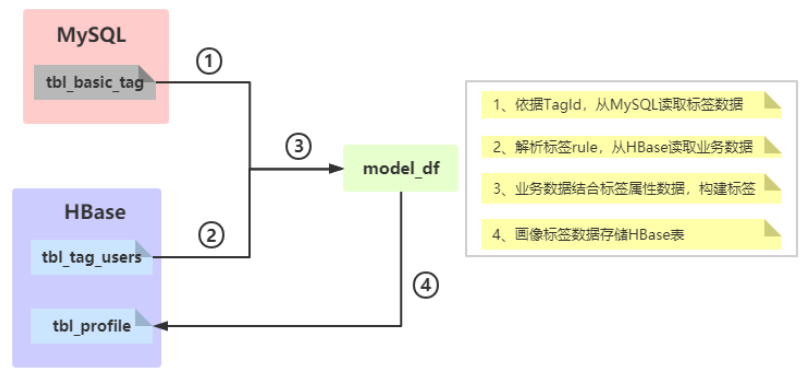
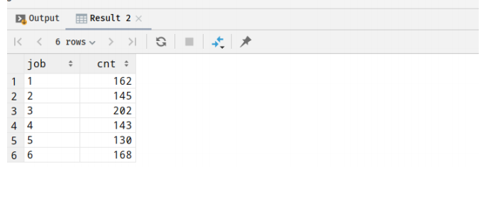
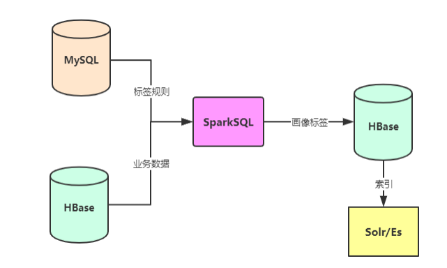
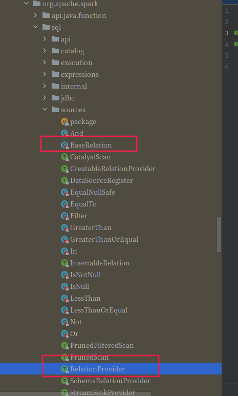

### 标签模型：用户性别标签

> 向以规则匹配中性别标签为例，开发整个标签模型，熟悉开发过程，对标签的构建整体认识，如下为管理平台首先需要新建标签


标签模型开发具体流程，数据流程详细图如下所示：



~~~ mysql
CREATE TABLE `tbl_basic_tag` (
`id` bigint(20) NOT NULL AUTO_INCREMENT,
`name` varchar(50) DEFAULT NULL COMMENT '标签名称',
`industry` varchar(30) DEFAULT NULL COMMENT '行业、子行业、业务类型、标签、属
性',
`rule` varchar(300) DEFAULT NULL COMMENT '标签规则',
`business` varchar(100) DEFAULT NULL COMMENT '业务描述',
`level` int(11) DEFAULT NULL COMMENT '标签等级',
`pid` bigint(20) DEFAULT NULL COMMENT '父标签ID',
`ctime` datetime DEFAULT NULL COMMENT '创建时间',
`utime` datetime DEFAULT NULL COMMENT '修改时间',
`state` int(11) DEFAULT NULL COMMENT '状态：1申请中、2开发中、3开发完成、4已上
线、5已下线、6已禁用',
`remark` varchar(100) DEFAULT NULL COMMENT '备注',
PRIMARY KEY (`id`)
) ENGINE=InnoDB AUTO_INCREMENT=307 DEFAULT CHARSET=utf8 COMMENT='基础标签
表';

CREATE TABLE `tbl_model` (
`id` bigint(20) NOT NULL AUTO_INCREMENT,
`tag_id` bigint(20) DEFAULT NULL,
`model_name` varchar(200) DEFAULT NULL,
`model_main` varchar(200) DEFAULT NULL,
`model_path` varchar(200) DEFAULT NULL,
`sche_time` varchar(200) DEFAULT NULL,
`ctime` datetime DEFAULT NULL,
`utime` datetime DEFAULT NULL,
`state` int(11) DEFAULT NULL,
`args` varchar(100) DEFAULT NULL,
PRIMARY KEY (`id`)
) ENGINE=InnoDB AUTO_INCREMENT=2 DEFAULT CHARSET=utf8;

-- 1、基础标签tbl_basic_tag
INSERT INTO `tbl_basic_tag` VALUES ('318', '性别', null,
'inType=hbase\nzkHosts=bigdatacdh01.itcast.cn\nzkPort=2181\nhbaseTable=tbl_tag_users\nfamily=detail\nselec
tFieldNames=id,gender', null, '4', '314', '2019-12-03 11:11:54', '2019-12-03
11:11:54', null, null);
INSERT INTO `tbl_basic_tag` VALUES ('319', '男', null, '1', null, '5',
'318', '2019-12-03 11:28:03', '2019-12-03 11:28:03', null, null);
INSERT INTO `tbl_basic_tag` VALUES ('320', '女', null, '2', null, '5',
'318', '2019-12-03 11:28:39', '2019-12-03 11:28:39', null, null);

-- 2、模型表tbl_model
INSERT INTO `tbl_model` VALUES ('1', '318', 'MATCH',
'cn.itcast.tags.models.rule.GenderModel', 'hdfs://bigdatacdh01.itcast.cn:8020/apps/temp/jars/9f0d015b-8535-4538-8722-
1d9a331069d1.jar', '4,2019-12-03 10:00:00,2029-12-03 10:00:00', '2019-12-03
11:11:54', '2019-12-03 11:11:54', '4', '--driver-memory 512m --executormemory 512m --num-executors 1 --executor-cores 1');
~~~

相关字段信息如下：

~~~ shell
标签名称：性别
标签分类：电商-某商城-人口属性
更新周期：
业务含义：注册会员的性别
标签规则：
inType=hbase
zkHosts=bigdata-cdh01.itcast.cn
zkPort=2181
hbaseTable=tbl_tag_users
family=detail
selectFieldNames=id,gender
程序入口：
cn.itcast.tags.models.rule.GenderModel
算法名称：
MATCH
算法引擎：
tags-model_2.11.jar
模型参数：
--driver-memory 512m --executor-memory 512m --num-executors 1 --
executor-cores 1
~~~

主要分为四个步骤：

~~~shell
// 1 依据TagId,从MySQL读取标签数据
// 2 解析标签rule,从HBase读取业务数据
// 3 业务数据结合标签属性数据，构建标签
// 4 画像标签数据存储HBase表
~~~

涉及技术核心点（难点）

~~~ shell
第一、如何从HBase表读取和写入数据
第二、标签匹配与标签合并
标签合并：将历史标签数据与计算标签数据进行合并
第三、基于DataFrame DSL开发
使用select,filter,groupBy,agg等函数，内置函数：functions._
~~~

标签数据读取

首先从基础标签表tbl_basic_tag 中读取性别相关的标签数据： 业务标签和属性标签。

依据业务标签ID读取标签相关的数据： 业务标签数据和对应属性标签数据，sql如下：

~~~mysql
(
SELECT `id`,
`name`,
`rule`,
`level`
FROM `profile_tags`.`tbl_basic_tag`
WHERE id = 318
UNION
SELECT `id`,
`name`,
`rule`,
`level`
FROM `profile_tags`.`tbl_basic_tag`
WHERE pid = 318
ORDER BY `level` ASC, `id` ASC
) AS basic_tag
~~~

查询结果如下： 


读取Hbase表的业务数据：

业务数据存储在HBase表中，此处采用TableInputFormt的方式读取数据，编写工具类，其中涉及如何将RDD转换为DataFrame。

构建标签：

依据获取的业务属性标签数据中的规则，进行关联匹配，构建每个用户的性别标签，如下图示：


### 标签模型：职业标签

在标签管理平台新建对应的标签（业务标签和属性标签），编写标签模型类，实现标签计算。

~~~mysql
`job` varchar(60) DEFAULT NULL COMMENT '职业；1学生、2公务员、3军人、4警察、5教
师、6白领'
-- SQL 语句
SELECT job, COUNT(1) AS cnt FROM tags_dat.tbl_users GROUP BY job ;
~~~



**新建标签**

新建业务（4级）标签：职业标签，相关字段信息如下：

~~~shell
标签名称：职业
标签分类：电商-某商城-人口属性
更新周期：
业务含义：注册用户的职业
标签规则：
inType=hbase
zkHosts=bigdata-cdh01.itcast.cn
zkPort=2181
hbaseTable=tbl_tag_users
family=detail
selectFieldNames=id,job
程序入口：
cn.itcast.tags.models.rule.JobModel
算法名称：
MATCH
算法引擎：
tags-model_2.11.jar
模型参数：
--driver-memory 512m --executor-memory 512m --num-executors 1 --
executor-cores 1
~~~

新建属性（5级）标签：1 学生、 2 公务员、3 军人、4 警察、5 教师、6 白领，相关字段信息

**模型开发**

在标签管理平台web新建标签，（业务标签4级标签和属性标签5级标签），参考用户性别标签模型修改其中标签的计算部分，使用UDF函数，完成标签匹配计算。


**优化项**
        对于开发规则规则匹配类型标签，用户性别标签和用户职业标签计算标签时，分别使用DataFrame Join 和 自定义UDF函数关联给咱，计算获取的对应标签ID.

​         因为Join操作对两个表key值相同额记录进行连接，在SparkSql中，对两个表做Join最直接的方式是先根据key分区，再在每个分区找那个把key值相同的记录拿出来做连接操作。但这样就不可避免地涉及shuffle,而shuffle在Spark是比较耗时的操作，应该尽可能的设计spark应用避免大量避免大量的shuffle.
当维度表（小表）和事实表（大表）进行join操作时，为了避免shuffle,可以将大小有限的维度表（小表）的全部数据分发到每个节点上，供事实表使用。executor存储维度表的全部数据，一定程度牺牲了空间，换取了shuffle操作大量耗时，这个在sparkSql称作BroadCast join.


### 标签模型：政治面貌

在标签管理平台新建对应的标签（业务标签和属性标签），编写标签模型类，继承标签模型基类BasticModel,实现其中标签的计算方法dotTag.

~~~sql
`politicalFace` int(1) unsigned DEFAULT NULL COMMENT '政治面貌：1群众、2党员、3
无党派人士'
~~~

**新建标签**

新建业务（4级）标签：政治面貌，相关字段如下：

~~~shell
标签名称：政治面貌
标签分类：电商-某商城-人口属性
更新周期：
业务含义：注册用户的政治面貌
标签规则：
inType=hbase
zkHosts=bigdata-cdh01.itcast.cn
zkPort=2181
hbaseTable=tbl_tag_users
family=detail
selectFieldNames=id,politicalface
程序入口：
cn.itcast.tags.models.rule.PoliticalModel
算法名称：
MATCH
算法引擎：
tags-model_2.11.jar
模型参数：
--driver-memory 512m --executor-memory 512m --num-executors 1 --
executor-cores 1
~~~

新建属性（5级）标签：1 群众、2党员、3无党派人士，相关字段信息如下：

~~~shell
1）、属性值【群众】
标签名称：群众
标签含义：政治面貌为群众
标签规则：1
2）、属性值【党员】
标签名称：党员
标签含义：政治面貌为党员
标签规则：2
3）、属性值【无党派人士】
标签名称：无党派人士
标签含义：政治面貌为无党派人士
标签规则：3
~~~

### 标签模型：国籍

新建业务标签（4级）： 国籍，相关字段信息如下：

~~~shell
标签名称：国籍
标签分类：电商-某商城-人口属性
更新周期：
业务含义：注册用户所属的国籍：中国大陆、中国香港、中国澳门、中国台湾、其他
标签规则：
inType=hbase
zkHosts=bigdata-cdh01.itcast.cn
zkPort=2181
hbaseTable=tbl_tag_users
family=detail
selectFieldNames=id,nationality
程序入口：
cn.itcast.tags.models.rule.NationalityModel
算法名称：
MATCH
算法引擎：
tags-model_2.11.jar
模型参数：
--driver-memory 512m --executor-memory 512m --num-executors 1 --
executor-cores 1
~~~

新建属性（5级）标签：1中国大陆、2中国香港、3中国澳门、4中国台湾、5其他，相关字段信息如下：

~~~shell
1）、属性值【中国大陆】
标签名称：中国大陆
标签含义：国籍是中国大陆
标签规则：1
2）、属性值【中国香港】
标签名称：中国香港
标签含义：国籍是中国香港
标签规则：2
3）、属性值【中国澳门】
标签名称：中国澳门
标签含义：国籍是中国澳门
标签规则：3
4）、属性值【中国台湾】
标签名称：中国台湾
标签含义：国籍是中国台湾
标签规则：4
5）、属性值【其他】
标签名称：其他
标签含义：国籍是其他
标签规则：5
~~~


### 标签数据总述

每一个标签模型任务流程如下所示：




用户画像标签系统中的每个标签（业务标签、4级标签）的模型开发，涉及到三种类型的数据，如下图：


具体说明：

* 1、标签数据

  每个标签模型开发（给每个用户或每个商品打每个标签），必须先在标签管理平台注册【新建标
  签】
  业务标签（4级标签）、属性标签（5级标签）
  注册以后，每个标签（业务标签）对应的属性值（属性标签）都有对应标签标识符：tagId
  属性标签ID，标识每个标签，将会打到每个用户或商品上，标识此用户或商品的具体标签
  每个业务标签对应一个模型，就是一个Spark Application程序
  运行此应用程序可以给用户或商品打标签
  在模型表中记录标签对应的模型关系，以及模型运行时参数信息

  

* 2、 业务数据

  每个标签（业务标签，4级标签）开发，需要读取对应的业务数据，比如用户性别标签，需要读取【注册会员表】数据（获取用户ID：id和用户性别：gender），进行打标签。本项目中主要涉及到四类业务数据，给用户和商品打标签，构建画像。

  

* 3、 画像标签数据

  给每个用户或每个商品打上标签以后，存储到HBase表及Elasticsearch索引中，便于查询检索
  使用
  画像标签表名称：
  tbl_profile, user

​      

### 自定义外部数据源

在标签模型编码中，需要从HBase表读写数据，编写HBaseTools工具类，其中提供read和write方法，传递参数读写表的数据，但是能否实现类似SparkSQL读写MySql数据库表数据时如下格式：

~~~scala
// load：加载数据
val jdbcDF = spark.read
.format("jdbc") // 指定数据源
.option("driver", "com.mysql.jdbc.Driver") // 参数
.option("url", "jdbc:postgresql:dbserver")
.option("dbtable", "schema.tablename")
.option("user", "username")
.option("password", "password")
.load() // 加载数据
// save: 保存数据
jdbcDF.write
.format("jdbc") // 指定数据源
.option("driver", "com.mysql.jdbc.Driver") // 参数
.option("url", "jdbc:postgresql:dbserver")
.option("dbtable", "schema.tablename")
.option("user", "username")
.option("password", "password")
.save() // 保存数据
~~~

**External DataSource**

自从Spark1.3发布，Spark SQL 开始正式支持外部数据源。Spark SQL 开放了一系列接入外部数据源的接口，来让开发者可以实现，接口在org.apache.spark.sql.source包下：

interfaces.scala 。

[在线文档]: https://github.com/apache/spark/blob/branch-2.2/sql/core/src/main/scala/org/apache/spark/sql/sources/interfaces.scala



主要两个类：**BaseRelation** 和 **RelationProvider**

如果实现一个外部数据源，比如hbase数据源，支持Spark SQL  操作 HBase 数据库。那么就必须定义HBaseRelation来继承BaseRelation，同时也要定义DefaultSource实现一个RelationProvider。

1） BaseRelation

代表了一个抽象的数据源；

该数据源有一行行有着已知schema的数据组成（关系表）

展示了从DataFrame中产生的底层数据源的关系或者表

定义如何产生schema信息

~~~scala
package org.apache.spark.sql.sources
@org.apache.spark.annotation.InterfaceStability.Stable
abstract class BaseRelation() extends scala.AnyRef {
  def sqlContext : org.apache.spark.sql.SQLContext
  def schema : org.apache.spark.sql.types.StructType
  def sizeInBytes : scala.Long = { /* compiled code */ }
  def needConversion : scala.Boolean = { /* compiled code */ }
  def unhandledFilters(filters : scala.Array[org.apache.spark.sql.sources.Filter]) : scala.Array[org.apache.spark.sql.sources.Filter] = { /* compiled code */ }
}

~~~

从外部数据源加载（读取）数据和保存（写入）数据时，提供不同接口实现，具体如下：

* 加载数据接口
* 

2）RelationProvider

顾明思义，根据用户提供的参数（parameters）返回一个数据源（BaseRelation）一个Relation的提供者，创建BaseRelation。

下图表示从SparkSQL提供外部数据源（External dataSource）加载数据时，需要继承的类说明如下：


**自定义HBaseRelation**

自定义HBaseRelation类，继承BaseRelation、TableScan 和 InsertableRelation,此外实现序列化接口Serializable,所有类声明如下，其中实现Serialzable接口为了保证对象可以被序列化和反序列化。


**正则表达式**简单介绍

```SCALA
"^" ：^会匹配行或者字符串的起始位置，有时还会匹配整个文档的起始位置。
"$" ：$会匹配行或字符串的结尾
"."：匹配除了换行符以外的任何字符
"*"(贪婪) 重复零次或更多
例如"aaaaaaaa" 匹配字符串中所有的a 正则： "a*" 会出到所有的字符"a"
"+"(懒惰) 重复一次或更多次
例如"aaaaaaaa" 匹配字符串中所有的a 正则： "a+" 会取到字符中所有的a字符，
"a+"与"a*"不同在于"+"至少是一次而"*" 可以是0次，
"?"(占有) 重复零次或一次
例如"aaaaaaaa" 匹配字符串中的a 正则 ： "a?" 只会匹配一次，也就是结果只是单个字符a
"( )"：标记一个子表达式的开始和结束位置
```


### 标签模型：年龄段

统计型标签，在人口属性（用户特征）和商业属性（消费特征）的标签中大部分是规则匹配类型标签和统计型标签，选取3个统计类型标签开发模型：年龄段标签、消费周期标签和支付方式标签。


**统计型标签**

统计型标签是需要使用聚合函数计算后得到标签，比如最近3个月的退单率，用户最常用的支付方式等等，主要开发三个统计类型标签：

~~~scala
1）、标签：年龄段
标签属性：50后、60后、70后、80后、90后、00后、10后、20后
数据来源：注册会员表
2）、标签：消费周期
标签属性：7日、2周、1月、2月、3月、4月、5月、6月
据来源：订单表
3）、标签：支付方式
标签属性：支付宝、微信、储蓄卡、信用卡
据来源：订单表
~~~

**统计类型标签与规则匹配类型标签区别**

~~~python
# 规则匹配型标签，按照字段关联
  依据业务字段的值，获取对应的标签值（tagName）
  基本上不涉及计算
# 统计类型标签，需要对业务的数据计算，在获取对应标签值（tagName）
  例如： count/max/min,在....之间，大于、小于等等
~~~

在构建用户画像时，其中用户年龄段非常重要，无论是数据表表分析，还是精准营销与个性推荐，往往需要依据用户的年龄段进行相关的营销与推荐，如下展示了某母婴社群依据年龄和性别分析报表案例：


在标签管理平台新建对应的标签（业务标签和属性标签），编写标签模型，继承标签模板基类AbastractModel,实现其中标签计算的方法doTag。

**新建业务标签**

新建 业务（4级）标签 ： 年龄段标签 ，相关字段信息如下

~~~shell
标签名称：年龄段
标签分类：电商-某商城-人口属性
更新周期：
业务含义：注册用户的年龄段
标签规则：
inType=hbase
zkHosts=bigdata-cdh01.itcast.cn
zkPort=2181
hbaseTable=tbl_tag_users
family=detail
selectFieldNames=id,birthday
程序入口：
cn.itcast.tags.models.statistics.AgeRangeModel
算法名称：
STATISTICS
算法引擎：
tags-model_2.11.jar
模型参数：
--driver-memory 512m --executor-memory 512m --num-executors 1 --
executor-cores 1
~~~


**新建属性标签**

新建属性（5级）标签： 年龄段标签，相关字段信息如下：

~~~python
1）、属性值【50后】
标签名称：50后
标签含义：注册会员出生日期为1950年-1959年区间的
标签规则：19500101-19591231
2）、属性值【60后】
标签名称：60后
标签含义：注册会员出生日期为1960年-1969年区间的
标签规则：19600101-19691231
3）、属性值【70后】
标签名称：70后
标签含义：注册会员出生日期为1970年-1979年区间的
标签规则：19700101-19791231
4）、属性值【80后】
标签名称：80后
标签插入SQL语句：
标签含义：注册会员出生日期为1980年-1989年区间的
标签规则：19800101-19891231
5）、属性值【90后】
标签名称：90后
标签含义：注册会员出生日期为1990年-1999年区间的
标签规则：19900101-19991231
6）、属性值【00后】
标签名称：00后
标签含义：注册会员出生日期为2000年-2009年区间的
标签规则：20000101-20091231
7）、属性值【10后】
标签名称：10后
标签含义：注册会员出生日期为2010年-2019年区间的
标签规则：20100101-20191231
8）、属性值【20后】
标签名称：20后
标签含义：注册会员出生日期为2020年-2029年区间的
标签规则：20200101-20291231
~~~

标签插入SQL语句：

~~~mysql
INSERT INTO `tbl_basic_tag` VALUES ('338', '年龄段', null,
'inType=hbase\nzkHosts=bigdatacdh01.itcast.cn\nzkPort=2181\nhbaseTable=tbl_tag_users\nfamily=detail\nsele
ctFieldNames=id,birthday', null, '4', '314', '2019-12-20 17:06:48', '2019-
12-20 17:06:48', null, null);
INSERT INTO `tbl_basic_tag` VALUES ('339', '50后', null, '19500101-
19591231', null, '5', '338', '2019-12-20 17:11:23', '2019-12-20 17:11:23',
null, null);
INSERT INTO `tbl_basic_tag` VALUES ('340', '60后', null, '19600101-
19691231', null, '5', '338', '2019-12-20 17:11:38', '2019-12-20 17:11:38',
null, null);
INSERT INTO `tbl_basic_tag` VALUES ('341', '70后', null, '19700101-
19791231', null, '5', '338', '2019-12-20 17:12:54', '2019-12-20 17:12:54',
null, null);
INSERT INTO `tbl_basic_tag` VALUES ('342', '80后', null, '19800101-
19891231', null, '5', '338', '2019-12-20 17:13:08', '2019-12-20 17:13:08',
null, null);
INSERT INTO `tbl_basic_tag` VALUES ('343', '90后', null, '19900101-
19991231', null, '5', '338', '2019-12-20 17:13:22', '2019-12-20 17:13:22',
null, null);
INSERT INTO `tbl_basic_tag` VALUES ('344', '00后', null, '20000101-
20091231', null, '5', '338', '2019-12-20 17:13:38', '2019-12-20 17:13:38',
null, null);
INSERT INTO `tbl_basic_tag` VALUES ('345', '10后', null, '20100101-
20191231', null, '5', '338', '2019-12-20 17:13:54', '2019-12-20 17:13:54',
null, null);
INSERT INTO `tbl_basic_tag` VALUES ('346', '20后', null, '20200101-
20291231', null, '5', '338', '2019-12-20 17:13:54', '2019-12-20 17:13:54',
null, null);
INSERT INTO `tbl_model` VALUES ('7', '338', 'Statistics',
'cn.itcast.tags.models.statistics.AgeRangeModel', 'hdfs://bigdatacdh01.itcast.cn:8020/apps/temp/jars/499e0416-da3d-496c-8a32-
994109918c17.jar', '0,2019-12-20 08:00:00,2029-12-20 08:00:00', '2019-12-20
17:06:48', '2019-12-20 17:06:48', '4', '--driver-memory 512m --executormemory 512m --num-executors 1 --executor-cores 1');
~~~

**标签模型分析**

~~~scala
/*
338 国籍
属性标签数据：
339 50后 19500101-19591231
340 60后 19600101-19691231
341 70后 19700101-19791231
342 80后 19800101-19891231
343 90后 19900101-19991231
344 00后 20000101-20091231
345 10后 20100101-20191231
346 20后 20200101-20291231
业务数据：
99 column=detail:birthday, value=1982-01-11 -> 19820111
分析思路：
比较birthday日期 在 某个年龄段之内，给予标签值（tagName）
19820111 -> 80后
实现：JOIN，UDF函数
*/
~~~


使用dataFrame中DSL编程，涉及到两个函数处理，说明如下：

~~~scala
// 函数：正则替换
/**
* Replace all substrings of the specified string value that match regexp
with rep.
*
* @group string_funcs
* @since 1.5.0
*/
def regexp_replace(e: Column, pattern: String, replacement: String):
Column
// 函数：在。。。范围之内
/**
* True if the current column is between the lower bound and upper bound,
inclusive.
*
* @group java_expr_ops
* @since 1.4.0
*/
def between(lowerBound: Any, upperBound: Any): Column = {
(this >= lowerBound) && (this <= upperBound)
}
~~~

### 标签模型：消费周期

> 消费周期 主要是获取用户在平台的最近消费时间，比如用户最后一次的消费时间是最近一周还是一个月，方便获取到长时间未消费的用户。

在标签管理平台新建对应的标签（业务标签、属性标签），编写标签模型类，继承标签模型基类AbstactModel，实现其中标签计算的方法doTag，业务字段为finishtime,订单完成时间。

~~~mysql
select memberId,finshTime From tags_dat.tbl_tag_orders limit 5;
~~~


**新建业务标签**

新建业务标签（4级）标签：消费周期标签，相关字段信息如下：

~~~shell
标签名称：消费周期
标签分类：电商-某商城-商业属性
更新周期：7天
业务含义：用户的消费周期：7日、2周、1月、2月、3月、4月、5月、6月
标签规则：
inType=hbase
zkHosts=bigdata-cdh01.itcast.cn
zkPort=2181
hbaseTable=tbl_tag_orders
family=detail
selectFieldNames=memberid,finishtime
程序入口：
cn.itcast.tags.models.statistics.ConsumeCycleModel
算法名称：
STATISTICS
算法引擎：
tags-model_2.11.jar
模型参数：
--driver-memory 512m --executor-memory 512m --num-executors 1 --
executor-cores 1
~~~

**新建属性（5级）标签**

新建属性标签：7日，2周，1月，2月，3月，4月，5月，6月，相关字段信息如下：

~~~python
1）、属性值【近7天】
标签名称：近7天
标签含义：消费周期是近7日
标签规则：0-7
2）、属性值【近2周】
标签名称：近2周
标签含义：消费周期是近2周
标签规则：8-14
3）、属性值【近1月】
标签名称：近1月
标签含义：消费周期是近1月
标签规则：15-30
4）、属性值【近2月】
标签名称：近2月
标签含义：消费周期是近60天
标签规则：31-60
5）、属性值【近3月】
标签名称：近3月
标签含义：消费周期是近90天
标签规则：61-90
6）、属性值【近4月】
标签名称：近4月
标签含义：消费周期是近120天
标签规则：91-120
7）、属性值【近5月】
标签名称：近5月
标签含义：消费周期是近150天
标签规则：121-150
8）、属性值【近半年】
标签名称：近半年
标签含义：消费周期是近半年
标签规则：151-180
~~~

属性标签数据插入【tbl_basic_tag】

~~~MYSQL
INSERT INTO `tbl_basic_tag` VALUES ('347', '消费周期', null,
'inType=hbase\nzkHosts=bigdatacdh01.itcast.cn\nzkPort=2181\nhbaseTable=tbl_tag_orders\nfamily=detail\nsel
ectFieldNames=memberid,finishtime', null, '4', '315', '2019-12-20
17:16:24', '2019-12-20 17:16:24', null, null);
INSERT INTO `tbl_basic_tag` VALUES ('348', '近7天', null, '0-7', null, '5',
'347', '2019-12-20 17:17:17', '2019-12-20 17:17:17', null, null);
INSERT INTO `tbl_basic_tag` VALUES ('349', '近2周', null, '8-14', null,
'5', '347', '2019-12-20 17:17:44', '2019-12-20 17:17:44', null, null);
INSERT INTO `tbl_basic_tag` VALUES ('350', '近1月', null, '15-30', null,
'5', '347', '2019-12-20 17:17:55', '2019-12-20 17:17:55', null, null);
INSERT INTO `tbl_basic_tag` VALUES ('351', '近2月', null, '31-60', null,
'5', '347', '2019-12-20 17:18:11', '2019-12-20 17:18:11', null, null);
INSERT INTO `tbl_basic_tag` VALUES ('352', '近3月', null, '61-90', null,
'5', '347', '2019-12-20 17:18:23', '2019-12-20 17:18:23', null, null);
INSERT INTO `tbl_basic_tag` VALUES ('353', '近4月', null, '91-120', null,
'5', '347', '2019-12-20 17:18:33', '2019-12-20 17:18:33', null, null);
INSERT INTO `tbl_basic_tag` VALUES ('354', '近5月', null, '121-150', null,
'5', '347', '2019-12-20 17:18:47', '2019-12-20 17:18:47', null, null);
INSERT INTO `tbl_basic_tag` VALUES ('355', '近半年', null, '151-180', null,
'5', '347', '2019-12-20 17:18:47', '2019-12-20 17:18:47', null, null);
INSERT INTO `tbl_model` VALUES ('8', '347', 'Statistics',
'cn.itcast.tags.models.statistics.ConsumeCycleModel', 'hdfs://bigdatacdh01.itcast.cn:8020/apps/temp/jars/ea4b2ff8-455d-44c1-9c41-
8c256c0f5730.jar', '2,2019-12-20 08:00:00,2029-12-20 08:00:00', '2019-12-20
17:16:24', '2019-12-20 17:16:24', '4', '--driver-memory 512m --executormemory 512m --num-executors 1 --executor-cores 1');
~~~

**業務思路分析**

~~~scala
1）、获取每个会员最近一个订单完成时间
按照memberid分组，获取finishtime最大值，使用max函数
2）、转换订单完成时间数据格式
1589817600 转换为日期格式（yyyy-MM-dd HH:mm:ss），使用from_unixtime函数
def from_unixtime(ut: Column): Column = withExpr {
FromUnixTime(ut.expr, Literal("yyyy-MM-dd HH:mm:ss"))
}
def from_unixtime(ut: Column, f: String): Column = withExpr {
FromUnixTime(ut.expr, Literal(f))
}
3）、计算当前日期与订单完成期相差天数
使用函数：datediff
/**
* Returns the number of days from `start` to `end`.
* @group datetime_funcs
* @since 1.5.0
*/
def datediff(end: Column, start: Column): Column = withExpr {
DateDiff(end.expr, start.expr)
}
4）、获取当前时间
使用函数：current_timestamp()、current_date()
/**
* Returns the current timestamp as a timestamp column.
*
* @group datetime_funcs
* @since 1.5.0
*/
def current_timestamp(): Column = withExpr { CurrentTimestamp() }
~~~

### 标签模型： 支付方式

> 用户的支付方式有很多种，比如支付宝、微信、货到付款、银联等等，需要知道用户最常用的支付方式，以便于了解用户最常用的支付平台。

在标签管理平台新建对应的标签（业务标签和属性标签），编写标签模型类，继承标签模型基类AbstactModel,实现其中标签的计算方法doTag.

**业务字段调研**

在mysql数据中，查看业务数据【订单表 tbl_tag_orders】中支付相关字段【paymentCode/paymentName】,编写sql看看有那些值，便于标签开发。

~~~mysql
-- 查看MySQL数据库中订单表tags_dat.tbl_tag_orders
SELECT paymentCode, paymentName from tags_dat.tbl_tag_orders limit 10 ;
/*
+-------------+-------------+
| paymentCode | paymentName |
+-------------+-------------+
| alipay | 支付宝 |
| alipay | 支付宝 |
| alipay | 支付宝 |
| cod | 货到付款 |
| cod | 货到付款 |
| alipay | 支付宝 |
| alipay | 支付宝 |
| alipay | 支付宝 |
| alipay | 支付宝 |
| alipay | 支付宝 |
+-------------+-------------+
*/
-- 查看支付编码和支付名称
SELECT paymentCode, paymentName, COUNT(1) AS cnt from
tags_dat.tbl_tag_orders GROUP BY paymentCode, paymentName;
/*
+-------------+-------------+-------+
| paymentCode | paymentName | cnt |
+-------------+-------------+-------+
| alipay | 支付宝 | 96425 |
| chinapay | 银联支付 | 4068 |
| cod | 货到付款 | 16832 |
| wxpay | 微信支付 | 2800 |
+-------------+-------------+-------+
*/
-- SELECT paymentCode, paymentName, COUNT(1) AS cnt from
tags_dat.tbl_orders GROUP BY paymentCode, paymentName;
-- 查看支付方式
SELECT paymentCode, COUNT(1) AS cnt from tags_dat.tbl_tag_orders GROUP BY
paymentCode;
/*
+-------------+-------+
| paymentCode | cnt |
+-------------+-------+
| alipay | 96425 |
| chinapay | 4068 |
| cod | 16832 |
| wxpay | 2800 |
+-------------+-------+
*/
-- SELECT paymentCode, COUNT(1) AS cnt from tags_dat.tbl_orders GROUP BY
paymentCode;
~~~

**新建业务标签**

新建业务标签（4级）标签：支付方式标签，相关字段信息如下：

~~~scala
标签名称：支付方式
标签分类：电商-某商城-商业属性
更新周期：1天
业务含义：用户订单的支付方式：支付宝、微信支付、银联支付、货到付款
标签规则：
inType=hbase
zkHosts=bigdata-cdh01.itcast.cn
zkPort=2181
hbaseTable=tbl_tag_orders
family=detail
selectFieldNames=memberid,paymentcode
程序入口：
cn.itcast.tags.models.statistics.PayTypeModel
算法名称：
STATISTICS
算法引擎：
tags-model_2.11.jar
模型参数：
--driver-memory 512m --executor-memory 512m --num-executors 1 --
executor-cores 1
~~~

**新建属性标签**

新建属性标签（5级）标签：支付宝，微信支付、银联支付、货到付款、相关字段信息如下：

~~~scala
1）、属性值【支付宝】
标签名称：支付宝
标签含义：喜欢用支付宝付款
标签规则：alipay
2）、属性值【微信支付】
标签名称：微信支付
标签含义：喜欢用微信付款
标签规则：wxpay
3）、属性值【银联支付】
标签名称：银联支付
标签含义：喜欢用银联付款
标签规则：chinapay
4）、属性值【货到付款】
标签名称：货到付款
标签含义：喜欢货到付款
标签规则：cod
~~~

属性标签插入【tal_basic_tag】:

~~~mysql
INSERT INTO `tbl_basic_tag` VALUES ('356', '支付方式', null,
'inType=hbase\nzkHosts=bigdatacdh01.itcast.cn\nzkPort=2181\nhbaseTable=tbl_tag_orders\nfamily=detail\nsele
ctFieldNames=memberid,paymentcode', null, '4', '315', '2019-12-20 17:26:23',
'2019-12-20 17:26:23', null, null);
INSERT INTO `tbl_basic_tag` VALUES ('357', '支付宝', null, 'alipay', null,
'5', '356', '2019-12-20 17:26:50', '2019-12-20 17:26:50', null, null);
INSERT INTO `tbl_basic_tag` VALUES ('358', '微信支付', null, 'wxpay', null,
'5', '356', '2019-12-20 17:27:04', '2019-12-20 17:27:04', null, null);
INSERT INTO `tbl_basic_tag` VALUES ('359', '银联支付', null, 'chinapay',
null, '5', '356', '2019-12-20 17:27:17', '2019-12-20 17:27:17', null, null);
INSERT INTO `tbl_basic_tag` VALUES ('360', '货到付款', null, 'cod', null,
'5', '356', '2019-12-20 17:27:32', '2019-12-20 17:27:32', null, null);
INSERT INTO `tbl_model` VALUES ('9', '356', 'Statistics',
'cn.itcast.tags.models.statistics.PayTypeModel', 'hdfs://bigdatacdh01.itcast.cn:8020/apps/temp/jars/cbcbe36a-2808-47e2-b476-
bec0b319c6c3.jar', '1,2019-12-20 08:00:00,2029-12-20 08:00:00', '2019-12-20
17:26:23', '2019-12-20 17:26:23', '4', '--driver-memory 512m --executormemory 512m --num-executors 1 --executor-cores 1');
~~~

**标签模型开发**

继承基类AbstactModel，实现标签计算方法doTag,涉及到订单表数据中字段值：

~~~python
10 column=detail:memberid, timestamp=1574240145469, value=13823431
10 column=detail:paymentcode, timestamp=1574240145469, value=alipay
~~~

DataSet/DataFrame中添加列函数withColumn，如果列存在就替换值，不存在创建新列：

~~~python
/**
* Returns a new Dataset by adding a column or replacing the existing
column
* that has the same name.
*
* @group untypedrel
* @since 2.0.0
*/
def withColumn(colName: String, col: Column): DataFrame
~~~

在DSL编程中窗口函数成都窗口设置使用window类，封装如下：

~~~scala
val window = Window
.partitionBy($"") // 分区字段设置
.orderBy($"".asc, $"".desc) // 排序字段及规则设置
val window = Window
.distributeBy($"") // 分区字段设置
.orderBy($"".asc, $"".desc) // 排序字段及规则设置
~~~

**开窗函数使用**

* sql实现

  ~~~mysql
  spark.sql(
  """
  |WITH tmp AS (
  |SELECT
  | *,
  | ROW_NUMBER() OVER(PARTITION BY deptno ORDER BY sal DESC)
  AS rnk
  |FROM
  | view_tmp_emp
  |)
  |SELECT
  | t.empno, t.ename, t.sal, t.deptno
  |FROM tmp t
  |WHERE t.rnk = 1
  |""".stripMargin)
  .show()
  ~~~

* DSL编程实现

  ~~~scala
  empDF
  // 使用函数，增加一列
  withColumn(
  "rnk", //
  row_number().over(
  Window.partitionBy($"deptno").orderBy($"sal".desc)
  )
  )
  // 获取rnk=1
  .where($"rnk" === 1)
  .select($"empno", $"ename", $"sal", $"deptno")
  .show()
  ~~~

  